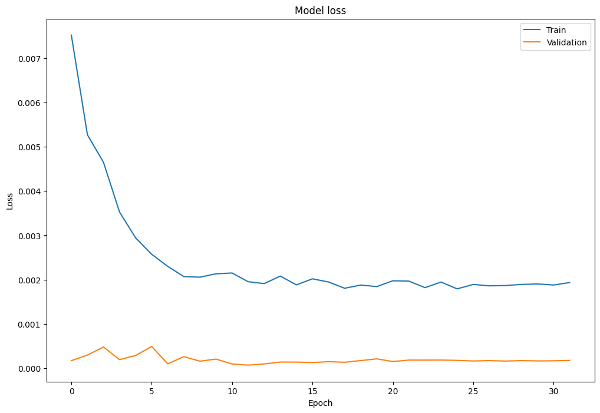

# Interest-Rate-Prediction_LSTM-Model

This project aims to predict future values of the SOFR (Secured Overnight Financing Rate) using historical data and various economic indicators. The primary features used for prediction include historical values of SOFR, EFFR (Effective Federal Funds Rate), FFF (Federal Funds Futures), inflation expectations, and unemployment rates.

## A. Time Series Forecasting with Deep Learning
### a) Data Loading and Preprocessing:
1. The dataset is loaded from a CSV file, and is normalized using the MinMaxScaler to ensure all features have values between 0 and 1, for training of the neural network.
2. The data is split into training, validation, and test sets using a 60-20-20 split ratio.

### b) Feature Engineering:
Lookback period is 20 days, meaning the model will use the past 20 days of data to predict the next day's SOFR value.
The dataset is transformed to create windows of 20-day sequences for training the model.

### c) Model Building:
The architecture comprises: Bidirectional LSTM layers, dropout layers for regularization, and batch normalization.

### d) Training:
1. The model is trained using the Adam optimizer with a learning rate of 0.00001.
2. Early stopping is implemented to halt training if the validation loss doesn't improve for a certain number of epochs.
3. The learning rate is reduced if the validation loss plateaus to make the model converges.
4. The best model weights are saved using model checkpointing.

### e) Evaluation:
The trained model's performance is evaluated using the Root Mean Squared Error (RMSE) on the training, validation, and test datasets.

## B. Hyperparameter Tuning
### a) Defining the Model with Hyperparameters:
The build_model function defines the architecture of the LSTM model. Within this function, hyperparameters are specified using the hp object. For instance, hp.Int('lstm_units_1', 30, 60, 10) indicates that the number of units in the first LSTM layer can vary between 30 and 60 in steps of 10
### b) Setting up the Tuner:
The RandomSearch class from keras-tuner is used to perform the hyperparameter search. It requires the model-building function (build_model), the optimization objective (val_loss in this case), and other parameters like the maximum number of trials.
### c) Search for Best Hyperparameters:
The tuner.search method initiates the hyperparameter search. It trains the model multiple times with different combinations of hyperparameters and validates the performance. Callbacks like early stopping and learning rate reduction are used during this process.